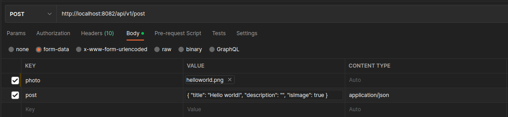

# Samuel Fernando da Silva Tavares | BackEnd - Parrot API
Meu projeto final de BackEnd para a 3ª edição do Bootcamp Excelência FullStack - SysMap Solutions

# Tecnologias utilizadas


# Rodando o projeto

Clone o repositório:

```sh
git clone https://github.com/bc-fullstack-03/Samuel-Fernando_backend.git
```

Entre no diretório raiz do projeto, e execute o docker-compose da aplicação para iniciar todos os contêineres:

```sh
cd Samuel-Fernando_backend
```

```sh
docker-compose up --build -d
```

Após os contêineres serem iniciados, será necessária a criação de um novo perfil e do S3 bucket no contêiner localstack-parrot para o upload de fotos ser funcional no backend. Para isso, será necessário executar os seguintes comandos:

```sh
docker exec -it localstack-parrot bash
```
```sh
aws configure --profile default
```
Será aberta uma série de configurações para o perfil, onde será preciso atribuir os seguintes dados:

- AWS Access Key ID [None]: myKey
- AWS Secret Access Key [None]: myKey
- Default region name [None]: us-west-2
- Default output format [None]: json

Após a criação do perfil, o bucket S3 para a aplicação poderá ser criado utilizando o seguinte comando:

```sh
aws s3 mb s3://demo-bucket --endpoint-url http://localhost:4566
```
Com o bucket S3 criado, a API estará pronta para uso completo.

# Acessando a API

Após todos os contêineres serem criados, a API poderá ser acessada em [localhost:8082](http://localhost:8082). 

# Documentação

A documentação dos endpoints da API estará disponível via Swagger em [localhost:8082/swagger-ui/index.html](http://localhost:8082/swagger-ui/index.html).

# Observação

Nos endpoints da API que recebem um arquivo e um json ao mesmo tempo no corpo da requisição, o json precisa ser enviado via form-data e com content type como application/json, como no exemplo abaixo da rota /api/v1/post:

